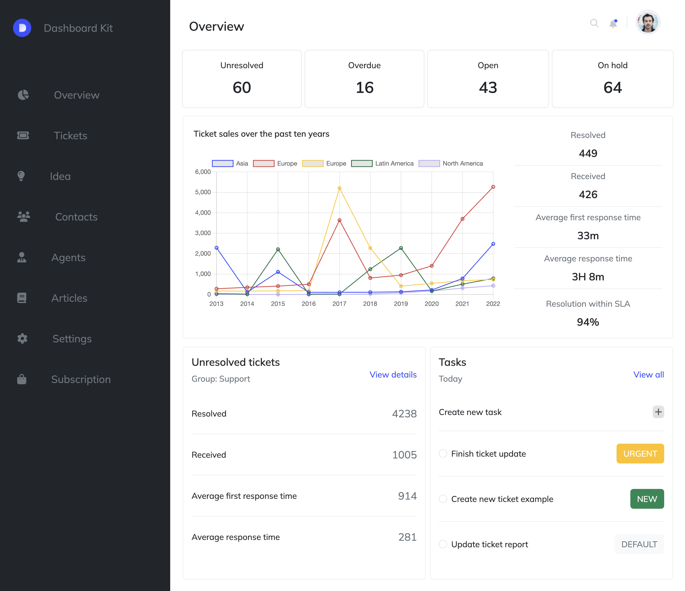

# Bootstrap project with Chart.js

 

## Project Overview

This web page is built using Bootstrap and HTML with Chart.js integration, following the design from a Figma prototype. The implementation is grounded in fundamental HTML and CSS, leveraging the capabilities of Bootstrap for enhanced styling and responsiveness.

## Tech Stack

- **Bootstrap**
- **HTML**
- **CSS**
- **Chart.js**

## How to Use

Include instructions on how to set up and run the project locally. This may involve steps such as:

1. Clone the repository: `git clone https://github.com/your-username/your-project.git`
2. Open the HTML file in a web browser or set up a local server.
3. Explore the interactive charts and responsive design.

Feel free to customize the instructions based on your project structure and setup.

